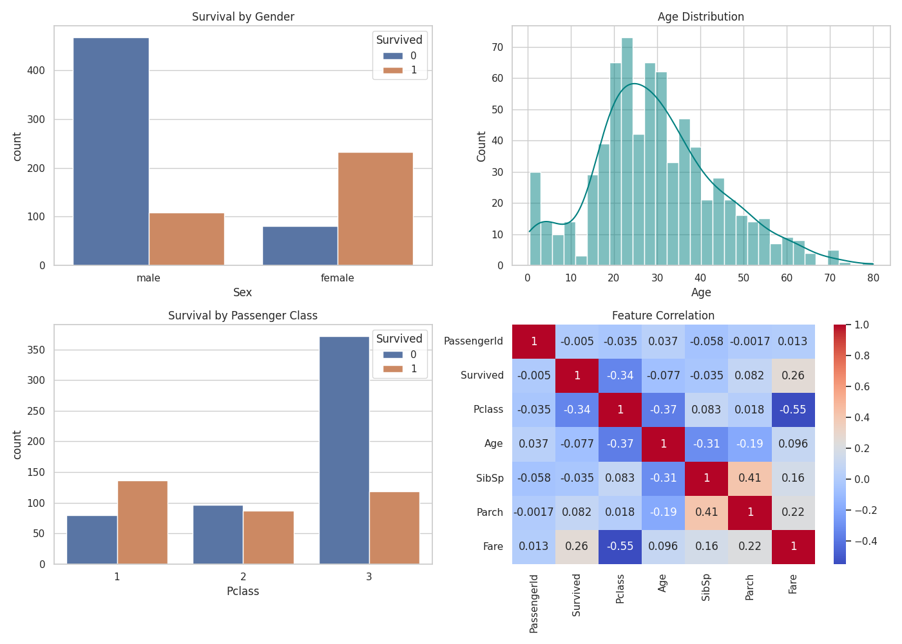

# 🚢 Task 2 – Titanic Dataset: Data Cleaning & Exploratory Data Analysis (EDA)

This project is part of my **Data Science Internship** with **Prodigy Infotech**.  
The goal of this task was to perform **data cleaning** and **exploratory data analysis (EDA)** on the famous **Titanic dataset** from Kaggle.

---

## 📁 Dataset
- **Source**: [Titanic - Machine Learning from Disaster (Kaggle)](https://www.kaggle.com/c/titanic/data)
- **Format**: CSV
- **Target Variable**: `Survived` (1 = survived, 0 = not survived)

---

## 🧹 Data Cleaning Summary

- Dropped irrelevant columns: `PassengerId`, `Ticket`, `Cabin`
- Filled missing values:
  - `Age` → median
  - `Embarked` → mode
- Converted categorical features:
  - `Sex`, `Embarked` → converted to category type

---

## 📊 Exploratory Data Analysis (EDA)

Visualizations created to identify survival trends and patterns:

- Survival counts (overall)
- Survival by **Gender**
- Survival by **Passenger Class (Pclass)**
- Distribution of **Age**
- **Heatmap** of numeric feature correlations

---

## 🧰 Tools & Libraries Used

- Python 🐍  
- pandas 🐼  
- seaborn 🎨  
- matplotlib 📈  

---

## 📸 Output Visual (Example)
If you're viewing this on GitHub, here’s a preview chart created during EDA:

---

## 🚀 How to Run the Notebook

1. Open `PRODIGY_DS_02.ipynb` in [Google Colab](https://colab.research.google.com/)
2. Upload the dataset
3. Run all cells step-by-step
4. Visualizations and results will appear inline

---

## 🔗 Repository Link

[👉 View on GitHub](https://github.com/ashraful2512/PRODIGY_DS_02)

---

